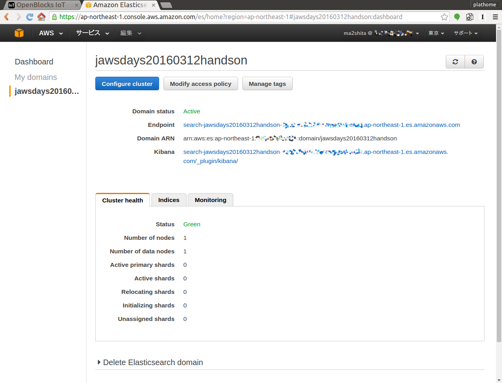
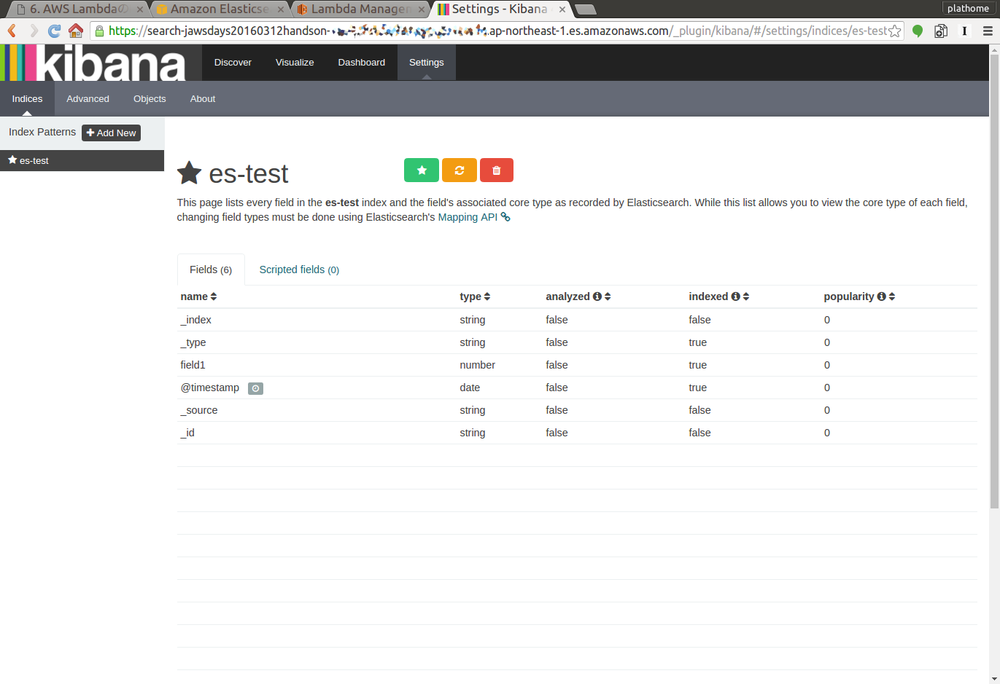
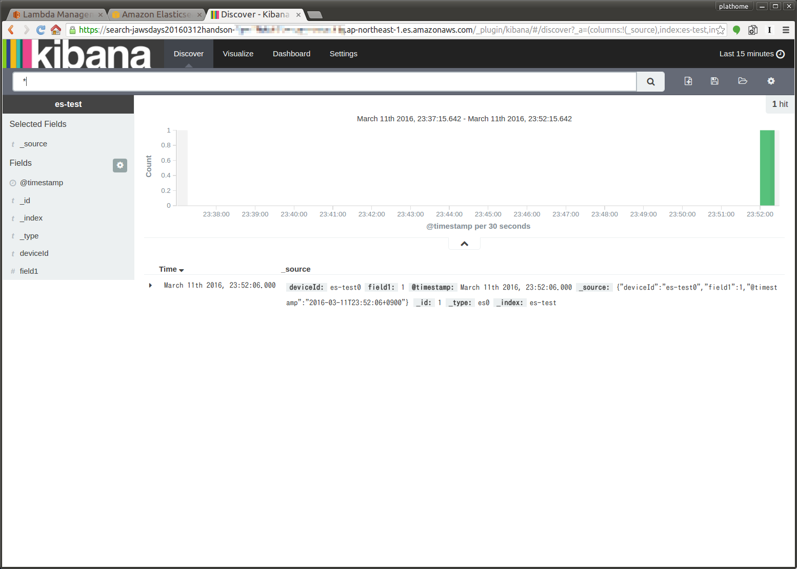

Amazon ESのインスタンス作成と設定
=================================

本章のゴール: **Amazon ES上のKibanaでテストデータのグラフが表示される**

作業の位置づけ;


Amazon ESのクラスタを作成
-------------------------

Get started (もしくはダッシュボードの Create a new domain) からAmazon ESのインスタンス作成のウィザードを開始します

それぞれのステップでは、下記項目を変更するようにしてください (それ以外の項目はデフォルト値でOKです)

+----------------------------------------+---------------------------------+
| Step1: Elasticsearch domain name       | ``jawsdays20160312handson``     |
+----------------------------------------+---------------------------------+
| Step2: Instance type                   | t2.micro.elasticsearch          |
+----------------------------------------+---------------------------------+
| Step2: Storage type                    | EBS                             |
+----------------------------------------+---------------------------------+
| Step3: Set the domain access policy to | Allow open access to the domain |
+----------------------------------------+---------------------------------+

.. warning::

  今回は時間の関係上 "Allow open access to the domain" (=すべてのアクセスを許可) としています。本番運用時にはアクセスコントロールを行うようにしてください

.. note::

  Amazon ESが使えるようになるまで10分程度かかるため、次章の作業(:doc:`04`) を行うとよいでしょう

ElasticsearchのEndpointとKibanaのURLを確認する
----------------------------------------------

Amazon ESのダッシュボードからESのEndpointとKibanaのURLを確認します



テストデータの投入と表示
------------------------

Amazon ESが利用可能になったら、動作確認を行います

データの投入
````````````
.. note::

  * ここでは確認のために ``curl`` コマンドを使用します。準備願います (`Windowsの方向け <http://techblo.hatenablog.com/entry/2015/08/06/214306>`_)
  * ``${YOUR_ES_ENDPOINT}`` は、Amazon ESのダッシュボードで確認した Endpoint に置き換えてください

TODO : tsを修正

.. code-block:: bash

    cat << EOT | curl -X POST ${YOUR_ES_ENDPOINT}/_bulk --data-binary @-
    {"index":{"_index":"es-test","_type":"type1","_id":"1"}}
    {"field1":1,"ts":"$(date +%Y-%m-%dT%H:%M:%S%z)"}
    EOT

コマンドの投入結果は下記のようになります

.. code-block:: json

    {"took":403,"errors":false,"items":[{"index":{"_index":"es-test","_type":"type1","_id":"1","_version":1,"status":201}}]}

errors が false なら成功です

Kibanaでの表示
``````````````

Indexを作成する
~~~~~~~~~~~~~~~

Amazon ESのダッシュボードで得た Kibana のURLにアクセスします

インデックスの設定を下記のとおりにします

+-----------------------+----------------+
| Index name or pattern | ``es-test``    |
+-----------------------+----------------+
| Time-field name       | ts             |
+-----------------------+----------------+


テストデータが正しく投入されていれば "Create" ボタンが押せるようになるはずですので、押してください

下記の通り、インデックスのカラム一覧が表示されれば成功です

※そうでない場合、テストデータの投入に失敗している可能性があります。コマンドの実行結果等を確認してください



データを表示する
~~~~~~~~~~~~~~~~

"Discover" をクリックするとデータの中身を表示することができます



ここまで到達できればゴールです

:doc:`04` へ進む

トラブルシュート
----------------

テストデータの投入に失敗した(ようなので)インデックスを削除する
``````````````````````````````````````````````````````````````

.. code-block:: bash

  $ curl -X DELETE ${YOUR_ES_ENDPOINT}/es-test

