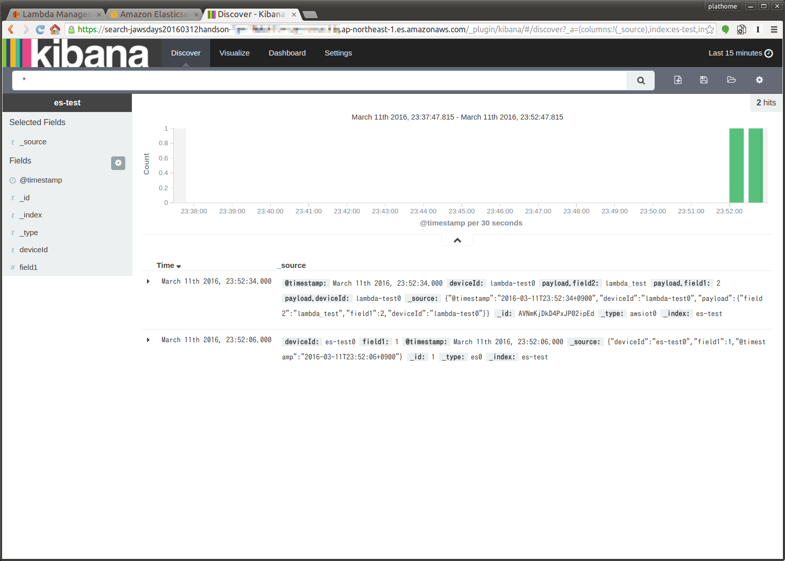

AWS LambdaのLambda function作成
===============================

本章のゴール: **AWS Lambdaを経由して投入したテストデータがAmazon ES上のKibanaで表示される**

作業の位置づけ;


IAMロールの作成
---------------

AWS Lambdaのfuctionを作成する前に、functionを実行するための権限ロールを作成します

ロールの作成
````````````

IAMコンソールのロール一覧から "新しいロールの作成" をクリックし、ウィザードを開始します

ウィザードの各項目は下記のようにしてください

+--------------------+-----------------------------------------+
| ロール名           | ``jawsdays20160312_lambda_exec``        |
+--------------------+-----------------------------------------+
| ロールタイプの選択 | AWS サービスロール => AWS Lambda を選択 |
+--------------------+-----------------------------------------+
| ポリシーのアタッチ | <なにも選択せず>                        |
+--------------------+-----------------------------------------+

インラインポリシーの設定
````````````````````````

#. IAMコンソールのロール一覧から、先ほど作成した *jawsdays20160312_lambda_exec* ロールを選択
#. "インラインポリシー" を選択 => "ここをクリックしてください" をクリック
#. "カスタムポリシー" => "選択" をクリック
#. 下記のとおりポリシー名とポリシードキュメントを設定し "ポリシーの検証" をした後 "ポリシーの適用" をクリック

+------------+-----------------------------------------------+
| ポリシー名 | ``jawsdays20160312_lambda_exec_adhoc_policy`` |
+------------+-----------------------------------------------+

ポリシードキュメント

.. code-block:: json

    {
      "Version": "2012-10-17",
      "Statement": [
        {
          "Effect": "Allow",
          "Action": [
            "logs:CreateLogGroup",
            "logs:CreateLogStream",
            "logs:PutLogEvents"
          ],
          "Resource": "arn:aws:logs:*:*:*"
        }
      ]
    }

function.zipの作成
------------------

今回のLambda functionはnpmモジュールを同梱する必要があるため、まずNode.jsとnpmが動作する環境で node_modules をインストールし、一式をzip化した後で、AWSのコンソールからアップロードするというアプローチを行います

function.zip作成の一連の作業
````````````````````````````

.. code-block:: bash

    $ mkdir TMP ; cd TMP
    ##>> create index.js <<##
    $ npm install elasticsearch moment-timezone
    $ zip -r function.zip *

index.js
````````

.. warning::

  下記コード内の YOUR_ES_ENDPOINT はAmazon ESのダッシュボードで得た Endpoint に書き換えるようにしてください

.. note::

  Amazon ESのインスタンス作成が完了してない場合は、とりあえず YOUR_ES_ENDPOINT のままにして function.zip をアップロードし、その他の確認を終えた後、再度 Endpoint を指定して再アップロードする方法があります

:download:`index.jsをダウンロードする <index.js>`

.. code-block:: javascript

    var es_endpoint = "YOUR_ES_ENDPOINT";
    /* e.g.) var es_endpoint = "search-jawsdays20160312handson-***.ap-northeast-1.es.amazonaws.com"; */

    /* requirement for input data
     * 1. include "deviceId" key and value (Use for doc id of ES)
     */

    var aws = require('aws-sdk');
    var elasticsearch = require('elasticsearch');
    var moment = require('moment-timezone');

    var timeObj = moment().tz("Asia/Tokyo");
    var es_index = "es-test";

    exports.handler = function(event, context) {
        console.log('Received event:');
        var searchRecords = [];

        var header = {
            "index":{
                "_index": es_index,
                "_type": 'log',
                "_id": event.deviceId + '-' + timeObj.format("YYYYMMDDHHmmss")
            }
        };
        searchRecords.push(header);

        var searchRecord = {
            "deviceId"   : event.deviceId,
            "@timestamp" : timeObj.format("YYYY-MM-DDTHH:mm:ssZZ"),
            "payload"    : event
        };
        searchRecords.push(searchRecord);

        console.log(searchRecords);
        var es = new elasticsearch.Client({host: es_endpoint}); 
        es.bulk({
            "body": searchRecords
        }, function(err, resp){
            if(err){
                console.log(err);
                context.done("error" ,err);
            }else{
                console.log("Success");
                console.log(JSON.stringify(resp));
                context.done(null, 'success');
            }
        });
    };

AWS Lambda function作成
-----------------------

Get started Now (もしくはダッシュボードの Create a Lambda function) から開始します

テンプレート選択画面では "Skip" を選択し、コード入力画面に遷移し、それぞれ下記の通り入力します

+----------------------+-----------------------------------------------------------+
| Name                 | ``jawsdays20160312_to_es``                                |
+----------------------+-----------------------------------------------------------+
| Description          | ``Convert from AWS IoT Data to Amazon ES``                |
+----------------------+-----------------------------------------------------------+
| Lambda function code | Upload a .ZIP file を選択 => 作成したfunction.zipをUpload |
+----------------------+-----------------------------------------------------------+
| Role                 | ``jawsdays20160312_lambda_exec``                          |
+----------------------+-----------------------------------------------------------+

テスト
------

テストデータを設定
``````````````````

[Actions] - [Configure test event] に下記JSONを入力して "Save" してください

.. code-block:: json

  { "deviceId": "lambda-test0",
    "field1" : 2,
    "field2" : "lambda_test"
  }


テストを実行し、Amazon ESでデータを確認する
```````````````````````````````````````````

"Test" でLambda functionのテストを実行できます

"Execution result: succeeded" ならばAmazon ESのKibana上で 先ほど投入したテストデータが確認できます ("payload.キー: 値 という形になります")



ここまで到達できればゴールです

:doc:`05` へ進む

トラブルシュート
----------------

AWS Lambdaへのアップロード失敗
``````````````````````````````

たまにアップロードミスが発生します (赤い警告枠)

#. index.js の文法チェックを行ってください
#. 再度アップロードを実行してみてください

Lambda functionの実行失敗
`````````````````````````

#. ロールは適切に作成されていますか？
#. ログが出ない場合、ポリシーは適切に設定されていますか？

Amazon ESへの接続失敗
`````````````````````

AWS Lambdaの実行ログは下記のようになります

#. Amazon ESの Endpoint が間違っていないか確認してください (Amazon ESが起動していない場合も同様)

.. code-block:: none

  2016-03-06T12:35:56.627Z	f939f4fc-e397-11e5-a054-e124be4befa5	{ [Error: No Living connections] message: 'No Living connections' }
  2016-03-06T12:35:56.627Z	f939f4fc-e397-11e5-a054-e124be4befa5	{"errorMessage":"error"}

